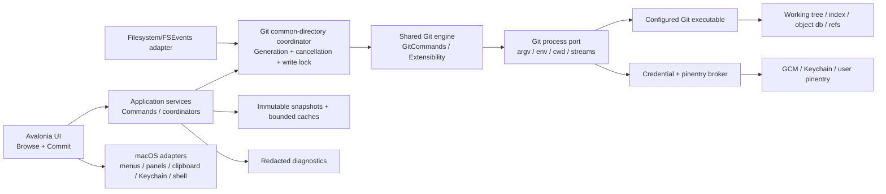
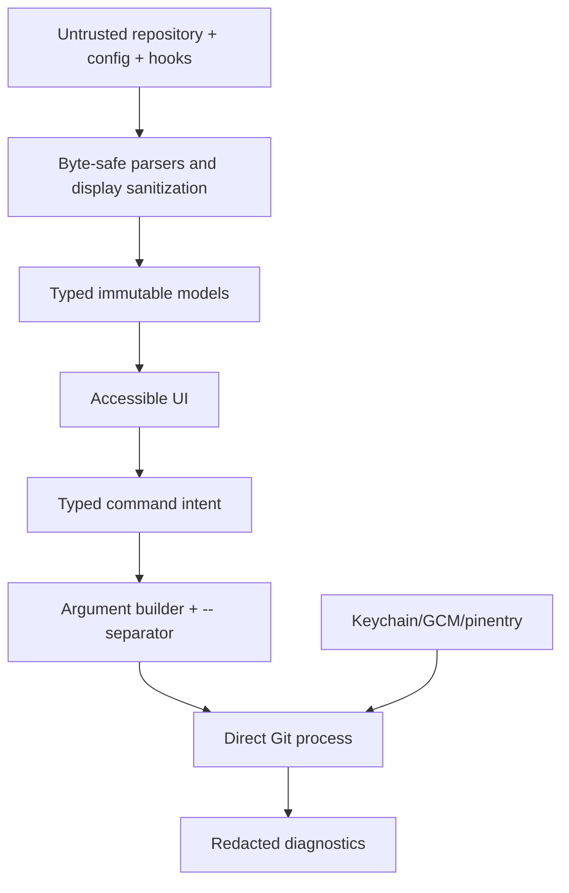

# Proposed architecture

## Principles

1. **Upstream first:** extend the existing Avalonia port and shared services.
2. **Real Git is the semantic authority:** libraries may optimize reads later but cannot silently change mutation behavior.
3. **Ports and adapters:** platform/UI details stay outside Git/domain services.
4. **Immutable snapshots:** UI renders coherent versions and rejects stale async results.
5. **Serialized mutations:** only one index/ref mutation per repository at a time.
6. **Untrusted repositories:** paths, config, hooks, messages, output and remotes are hostile inputs.
7. **Parity before redesign:** isolate intentional macOS deviations from porting fixes.

## Runtime view



## Layer responsibilities

### Presentation (`GitUI.Avalonia`)

- views and controls;
- selection/focus/accessibility state;
- command binding and enablement;
- view-only formatting and graph/diff rendering;
- no direct shell invocation and no persistent Git mutation logic.

The upstream draft intentionally mirrors WinForms class/folder/member names and code-behind. Preserve that mapping while parity is under review; extract testable application logic when a concrete bug or duplication warrants it rather than imposing an unrelated MVVM rewrite.

### Application services

- `OpenRepository`;
- `LoadRefsTree`;
- `LoadRevisionPage`;
- `SelectCommit`/`LoadCommitDetails`;
- `RefreshStatus`;
- `StageSelection`/`UnstageSelection`/`ApplyPatchSelection`;
- `ValidateCommit`/`CreateCommit`;
- operation progress, cancellation, error mapping and refresh invalidation.

Each request carries `RepositoryId`, snapshot generation, cancellation token and correlation ID. Each result is immutable and labels partial/truncated/error states explicitly.

### Domain/shared Git model

Reuse upstream types and algorithms where framework-independent:

- revisions, refs and object IDs;
- revision query/reader and graph lane model;
- file status and diff models;
- commit message/template/metadata behavior;
- settings and translations;
- command/argument builders.

Do not fork these models into macOS-specific copies unless upstream’s contract is intrinsically Windows-only and a reviewed adapter cannot solve it.

### Infrastructure ports

```text
IGitProcessRunner
IGitExecutableLocator
IRepositoryWatcher
IPlatformPaths
INativeDialogService
IClipboardService
ICredentialPromptBroker
IShellIntegration
INotificationService
IUpdateService                 # post-MVP
IDiagnosticsSink
IClock                          # deterministic tests only
```

Prefer existing upstream interfaces; add only the smallest boundary that removes an actual platform dependency.

## Repository consistency model

### Reads

- Every refresh increments or captures a generation.
- Parallel independent reads are allowed with bounded concurrency.
- UI applies a result only when repository identity and generation still match.
- Status, graph, details and diff may refresh independently, but composite UI labels the loading state and does not mix incompatible snapshots as if atomic.

### Writes

- A coordinator keyed by canonical Git **common directory** serializes mutations across linked worktrees. This is deliberately conservative for MVP: linked worktrees may have separate worktree/index state but share refs and object storage. Finer-grained locks are allowed later only with equivalence and race tests.
- Before a destructive or partial-patch write, capture required preconditions (index checksum/tree ID/worktree stat context).
- Execute one Git operation using direct argv.
- Read back exact resulting index/worktree/ref/object state.
- Publish a new generation only after verification.
- Never retry a write automatically after an unknown outcome.

### External changes

Watch `.git` common/worktree dirs and relevant worktree paths, debounce bursts, and schedule a rescan. Filesystem events are hints, not truth; Git readback is authoritative. Detect volume disconnect, watcher overflow and changed Git dir location, then expose explicit degraded state and manual refresh.

## Git process boundary

```csharp
public sealed record GitInvocation(
    string Executable,
    string WorkingDirectory,
    IReadOnlyList<string> Arguments,
    IReadOnlyDictionary<string, string?> Environment,
    GitInput Input,
    GitOperationKind Kind);

public sealed record GitResult(
    int ExitCode,
    ReadOnlyMemory<byte> StandardOutput,
    ReadOnlyMemory<byte> StandardError,
    bool WasCancelled,
    TimeSpan Duration);
```

The sketch expresses the contract, not a requirement to replace upstream types. Important properties:

- no command string passed to `/bin/sh`;
- preserve bytes/NUL delimiters until parsing boundaries;
- fixed locale/color/pager/editor environment for machine reads;
- interactive environment only for intentional hook/signing/credential flows;
- process-group cancellation on macOS: request interruption with SIGINT, allow a bounded grace period, then escalate without leaving hook descendants running;
- redacted structured diagnostics.

## UI composition

```text
App
├── RepositoryWindow
│   ├── NativeMenuBridge
│   ├── RepositoryToolbar
│   ├── RepoObjectsTree
│   ├── RevisionGrid
│   │   └── RevisionGraphRenderer
│   └── CommitDetails
│       ├── CommitHeader
│       ├── ChangedFilesList
│       └── DiffViewer
└── CommitWindow
    ├── StatusToolbar
    ├── StagedFiles
    ├── UnstagedFiles
    ├── DiffViewer + PatchSelection
    ├── CommitMessageEditor
    └── CommitOptions + Action
```

Split panes persist sizes but must have usable defaults, minimums and keyboard alternatives. Selection is model identity, not visual row index.

## Error model

Map raw failures into typed categories while retaining a redacted diagnostic detail:

- invalid/not-a-repository;
- unsupported Git/version/capability;
- cancelled;
- index locked/concurrent modification;
- patch rejected/stale context;
- unresolved conflicts/repository operation in progress;
- missing identity/invalid message;
- hook rejected;
- signing/pinentry failed;
- authentication/network (post-MVP remote operations);
- permission/volume unavailable;
- malformed/unexpected Git output;
- internal/platform failure.

Never replace Git’s useful hook/signing output with a generic error, and never render untrusted control characters raw.

## Security boundaries



A repository can execute hooks during commit. The UI must make that inherited Git behavior understandable, but should not attempt to sandbox hooks invisibly and thereby change semantics.

## Packaging architecture

```text
Git Extensions Avalonia.app/
└── Contents/
    ├── Info.plist
    ├── MacOS/
    │   ├── GitExtensions.Avalonia
    │   ├── GitExtensions.ProcessGroupLauncher
    │   ├── managed/runtime files
    │   └── Plugins/                 # only reviewed portable plugins
    ├── Resources/
    │   ├── icons/translations/themes/dictionaries
    │   └── third-party notices
    └── _CodeSignature/
```

Resource lookup must use bundle/application paths rather than assumptions about a Windows executable filename. Sign nested executable code before the outer bundle, then notarize and staple the distributed artifact.

## Proposed source structure in the single repository

Retain upstream’s actual application layout at repository root:

```text
src/app/
├── GitExtensions.Avalonia/          # app bootstrap + mac process helper
├── GitUI.Avalonia/                  # ported views and platform compatibility
├── GitCommands/                     # shared Git behavior
├── GitExtensions.Extensibility/     # shared contracts/models
├── GitExtUtils/
└── ResourceManager/
eng/avalonia/                         # port map, parity ledger, scripts, evidence schema
tests/app/UnitTests/GitUI.Avalonia.Tests/
Casks/git-extensions-avalonia.rb      # Homebrew Cask
```

Do not create an unrelated greenfield folder hierarchy merely to satisfy an architectural diagram.

## Evolution after MVP

1. extract platform-neutral logic from paired WinForms/Avalonia views into shared services through small upstream PRs;
2. replace compatibility shims with proper abstractions when their behavior is understood and tested;
3. add remote/network operations and credential UX;
4. add plugin UI contracts that do not expose WinForms controls;
5. profile before adding libgit2/gitoxide read accelerators;
6. consider native macOS bridges only for integration gaps proved by tests.
